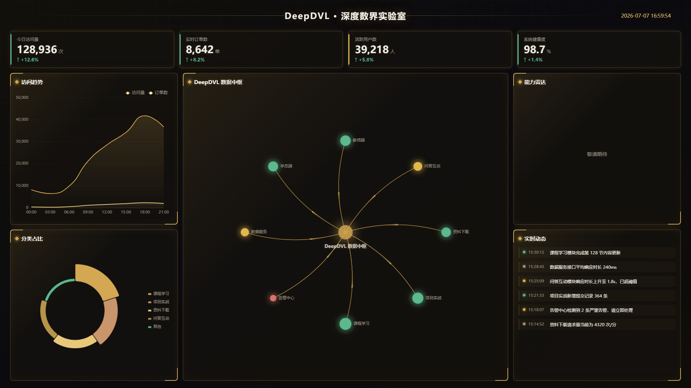

# DeepDVL · 深度数界实验室

> 一个带你从 0 到 1 亲手打造数据可视化大屏的公开学习项目。

[](./LICENSE)
[](https://github.com/FoxMinions/DeepDVL/actions/workflows/deploy.yml)

在线预览：**[foxminions.github.io/DeepDVL](https://foxminions.github.io/DeepDVL/)**

---

## 项目简介

**DeepDVL**（深度数界实验室）是一个以「教学」为唯一目的的开源项目。它把数据可视化大屏的开发过程拆成 **9 个可独立验证的阶段**，每阶段配一份可喂给 AI 的提示词 + 一段「为什么这么做」的讲解。

和「一次性给你一个成品」不同，本项目的目标是让你**真正理解每一行代码为什么这么写**，最终能脱离教程，独立做出属于自己的大屏。



## 适合谁

- 前端开发者，想做数据可视化但不知道从何下手
- 有一定 Vue 基础，想系统学习大屏的**布局适配、图表封装、工程化**实践
- 想要一个可以边看边动手、跟着 AI 增量构建的学习项目

## 技术栈

| 类别 | 技术 | 版本 |
|------|------|------|
| 框架 | Vue 3 (Composition API + `<script setup>`) | ^3.5 |
| 构建 | Vite 6 | ^6 |
| 语言 | TypeScript (strict) | ^5.6 |
| 可视化 | ECharts 5 | ^5.5 |
| 状态管理 | Pinia | ^2.2 |
| HTTP | Axios | ^1.7 |
| Mock | MSW (Mock Service Worker) | ^2.4 |
| 单元测试 | Vitest | ^2 |
| E2E 测试 | Playwright | ^1.45 |
| 代码规范 | ESLint 10 (flat config) + Prettier 3 + Stylelint 17 | — |

## 视觉主题：暗夜紫金

深黑底色 + 暗金/玫瑰金强调色 + 网格底纹 + 金色星云 + HUD 发光面板，营造「深度数界实验室」的奢华科技感与数据大屏的沉浸氛围。

 `--bg` `#0a0a0f` &nbsp;
 `--primary` `#d4a853` &nbsp;
 `--primary-light` `#e8c97a` &nbsp;
 `--accent` `#c9956b`

## 阶段进度

| # | 阶段 | 状态 |
|---|------|------|
| 1 | 项目脚手架与工程化 | ✅ |
| 2 | 大屏布局与自适应 | ✅ |
| 3 | 数据层与 mock/service 分层 | ✅ |
| 4 | 第一个图表与 ECharts 封装 | ✅ |
| 5 | 核心指标卡片与通用组件 | ✅ |
| 6 | 中心数据宇宙主视觉 | ✅ |
| 7 | 交互联动与定时刷新 | ✅ |
| 8 | 测试体系与代码质量 | ✅ |
| 9 | 收尾交付与部署 | ✅ |

## 目录结构

```
DeepDVL/
├── .github/workflows/deploy.yml   # GitHub Pages 自动部署
├── public/                        # 静态资源
│   └── mockServiceWorker.js       # MSW Service Worker
├── src/
│   ├── app/                       # 入口 (main.ts + styles.css)
│   ├── charts/                    # ECharts 图表组件
│   │   ├── DataHubChart.vue       # 中心数据宇宙主视觉
│   │   ├── LineTrendChart.vue     # 折线趋势图
│   │   └── PieCategoryChart.vue   # 分类玫瑰饼图
│   ├── components/                # 通用 UI 组件
│   │   ├── ActivityFeed.vue       # 实时动态列表
│   │   ├── BasePanel.vue          # HUD 面板外壳
│   │   ├── MetricCard.vue         # 指标卡片
│   │   └── ScreenHeader.vue       # 顶部标题栏 + 实时时间
│   ├── layouts/
│   │   └── BigScreenLayout.vue    # 16:9 自适应画布
│   ├── logs/                      # 日志系统
│   │   └── logger.ts
│   ├── mocks/                     # MSW mock 数据
│   │   ├── browser.ts
│   │   └── dashboardMock.ts
│   ├── services/                  # 数据服务层
│   │   ├── dashboardService.ts
│   │   ├── dataSource.ts
│   │   └── http.ts
│   ├── stores/                    # Pinia 状态管理
│   │   └── dashboardStore.ts
│   ├── tests/
│   │   ├── e2e/dashboard.spec.ts  # Playwright E2E
│   │   └── unit/                  # Vitest 单元测试
│   ├── types/                     # TypeScript 类型定义
│   │   └── dashboard.ts
│   ├── utils/                     # 工具函数
│   │   ├── format.ts
│   │   └── resize.ts
│   └── views/
│       └── DashboardView.vue      # 大屏主视图
├── docs/
│   ├── README.md                  # 文档中心入口
│   └── 提示词/                    # 9 阶段提示词 + 讲解
├── README.md                      # 你在这里
├── LICENSE                        # MIT
├── package.json
├── vite.config.ts
├── vitest.config.ts
├── playwright.config.ts
├── eslint.config.ts
├── tsconfig.json / .app / .node
└── .gitignore
```

## 本地运行

```bash
# 克隆仓库
git clone https://github.com/FoxMinions/DeepDVL.git
cd DeepDVL

# 安装依赖
npm install

# 启动开发服务（MSW mock 模式）
npm run dev

# 生产构建
npm run build

# 预览生产构建
npm run preview

# 运行单元测试
npm test

# 运行 E2E 测试（需要先 npm run dev）
npm run test:e2e

# 代码检查
npm run lint

# 代码格式化
npm run format
```

## 学习路线

本项目按 9 个阶段组织，每阶段对应一次 git commit。建议按顺序阅读：

1. 先读 [`docs/提示词/00-项目总览与使用说明.md`](./docs/提示词/00-项目总览与使用说明.md)
2. 按编号进入各阶段文档，了解该阶段**目标、设计理由、提示词、验收清单**
3. 跟着 `git log --oneline` 逐 commit 阅读源码演进
4. 把提示词喂给 AI，亲手实现一遍

> 每份阶段文档都有「思考题 / 进阶」一节，留给读者自己动手的扩展点。

## 开源协议

本项目基于 [MIT License](./LICENSE) 开源，欢迎自由学习、使用、修改与传播。

---

<p align="center">从 0 到 1，一起造一个属于自己的数据大屏</p>
